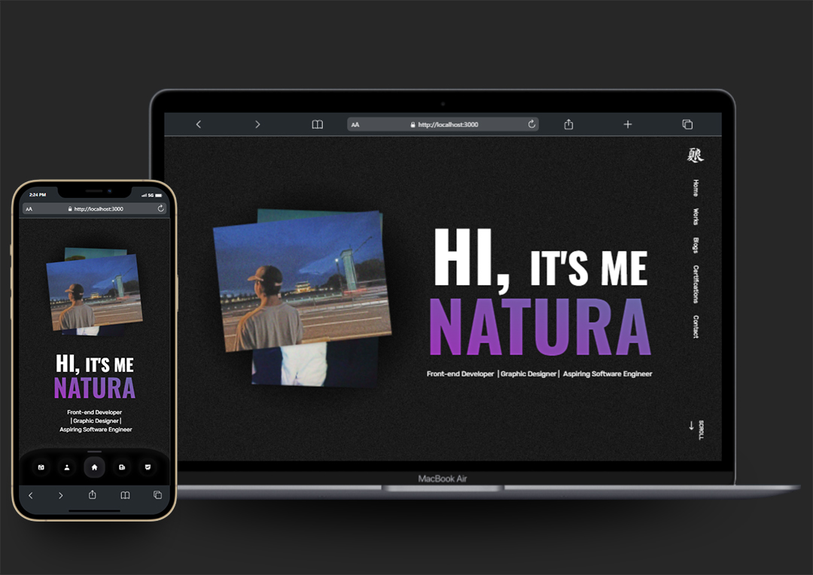

# NATURA'S FIRST EVER PERSONAL WEB

Finally, I am happy to tell that I deployed my first personal website (90% progress). It's taken 3 weeks to make this website and I had a lot of fun because I finally can tell a lot about myself, like who am I, what I do, etc. Here's the stack that I used on making this website :

- React JS
- TailwindCSS
- React Helmet Async
- React Router Dom v.6
- Framer Motion
  You can visit my website from this link: https://www.naturaadnyana.com
